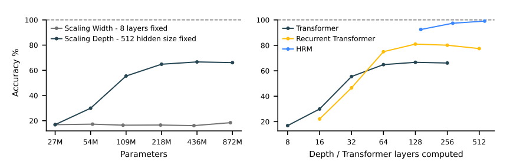
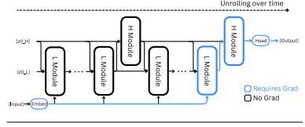

## HRM Overview


### Motivation and Scaling Behavior



> **Key Insight**: $\text{Performance} \propto \text{Depth}$ with diminishing returns from width scaling. We prefer adaptive iterative refinement over parameter expansion. By applying the Implicit Function Theorem assuming a fixed point from convergent features, we can use a one-step gradient approximation for optimization. 

A later variant proposed by *Less is More: Recursive Reasoning with Tiny Networks* computes a full-step gradient, resulting in significant improvement. 

**Remark**: More depth does not necessarily improve results even with *Hierarchical convergence*, as suggested by a recent reproduction of results—even compared to a typical recurrent transformer. We can practically consider the full-step gradient.

### Core Concept

- **L-Module (Low-level/Fast)**: The operator that mimics human low-level reasoning
- **H-Module (High-level/Slow)**: A periodically updated high-level reasoning controller that resets low-level state

#### L-Module (Low-level/Fast Module)
At each timestep $i$, the L-module updates its state conditioned on:
- Its own previous state $z_L^{i-1}$
- The H-module's current state $z_H^{i-1}$ (which remains fixed throughout the cycle)
- The input representation $\hat{x}$

$$z_L^i = f_L(z_L^{i-1}, z_H^{i-1}, \hat{x}; \theta_L)$$

#### H-Module (High-level/Slow Module)
The H-module updates **only once per cycle** (every $T$ timesteps), using the L-module's final state at the end of that cycle:

$$z_H^i = \begin{cases} 
f_H(z_H^{i-1}, z_L^{i-1}; \theta_H) & \text{if } i \equiv 0 \pmod{T} \\
z_H^{i-1} & \text{otherwise}
\end{cases}$$

After $N$ full cycles (i.e., $NT$ timesteps), a prediction $\hat{y}$ is extracted from the hidden state of the H-module:

$$\hat{y} = f_O(z_H^{NT}; \theta_O)$$

<p align="center">
  
</p>

### Implementation Details

**Input Embeddings Structure**:
```python
input_embeddings = [puzzle_emb | token_emb] + position_emb
# where:
#   - puzzle_emb: Zero-initialized task identifier
#   - token_emb: Actual problem tokens (input sequence)
```

**L-Level (Low-Level Module) Injection**:
```python
z_L = L_level(z_L, z_H + input_embeddings)

# Inside L_level.forward():
def forward(self, hidden_states, input_injection):
    hidden_states = hidden_states + input_injection  # z_L + (z_H + input_embeddings)
    # Process through layers...
```

**L-Module Update:**
```python
z_L = L_level(z_L, z_H + input_embeddings)
hidden_states = hidden_states + input_injection  # z_L + (z_H + input_embeddings)
```

**H-Module Update:**
```python
z_H = H_level(z_H, z_L) 
hidden_states = hidden_states + input_injection  # z_H + z_L
```

### Key Characteristics
1. **Temporal Hierarchy**: L-module operates at fine-grained timesteps; H-module operates at coarse-grained cycles
2. **Information Flow**: L→H (every T steps), H→L (every step, additive conditioning)
3. **Feature Refinement by Constraints**: A fixed stepwise input embedding and H-module's constraint allow progressive reasoning using the L-module

>The converged features are overfitted to a specific task and are essentially collapsed from general application—proposing a major challenge of transferring conditioning for alternative reasoning tasks. For long-term memory study, we hope to deal with this issue by using multiple memory cells and having agents communicate using a cross-attention bottleneck, as proposed below. 

## Proposal for long-term memory study 

### Key Insights

1. The iterative refinement mechanism is benefit mainly from encoder-only architectures with bidirectional attention. In decoder-only architectures, we are unable to refine previous tokens' representations where previous tokens remain frozen in the KV cache.

2. The H-level's design is oversimplified with the exact same architecture as the L-level according to their code implementation.

3. There are multiple ways for solving a sudoku, or multiple trajectories of reasoning for the same conclusion. A full-step gradient can be excessive, and we hope to frame this as RL objectives with one-step gradient approximation.

### 1. Architectural Proposal

**Reinterpretation**: We redesign the H-module as a bidirectional cross-attention mechanism with dual memory components:

**Components**:
- $z_H^t$: Persistent short-term memory (H-module state)
- $m^t$: Temporal long-term memory
- $z_L^{T-1}$: Final L-module state from current cycle


**State Normalization**:
- $\hat{h} = \text{LN}(z_H^t + z_L^{T-1})$: Initial combined state
- $\hat{m}^t = \text{LN}(m^t)$: Current memory state
- $\hat{h}^+ = \text{LN}(z_H^{t+1} + z_L^{T-1})$: Updated state after retrieval

**Temporal-Shift Update Pattern** (information flow across time steps):
- Retrieve: $m^t \rightarrow z_H^{t+1}$ (retrieve from current memory)
- Update: $z_H^{t+1} \rightarrow m^{t+1}$ (updated state gates writing to memory)

1. **Memory-to-State** (retrieve from current memory to update short-term state):
$$\Delta z = \text{Attention}(\hat{h}, \hat{m}^t, \hat{m}^t)$$
$$z_H^{t+1} = z_H^t + \Delta z + \text{FFN}(\text{LN}(z_H^t + \Delta z))$$

2. **State-to-Memory** (updated state gates what to write to memory):
$$\hat{h}^+ = \text{LN}(z_H^{t+1} + z_L^{T-1})$$
$$\Delta m = \text{Attention}(\hat{m}^t, \hat{h}^+, \hat{h}^+)$$
$$m^{t+1} = m^t + \Delta m + \text{FFN}(\text{LN}(m^t + \Delta m))$$


**Final Update Rules**:
$$z_H^i, m^i = \begin{cases} 
\text{BiCrossAttn}(z_H^{i-1}, m^{i-1}, z_L^{i-1}; \theta_H) & \text{if } i \equiv 0 \pmod{T} \\
z_H^{i-1}, m^{i-1} & \text{otherwise}
\end{cases}$$

where $\text{BiCrossAttn}$ implements the bidirectional updates above.

**Remark:** We could also define multiple distinct cells and activate the ones that are the most relevant to the current hidden state of the H-module, by adding cells' tokenwise features (which might have limited representation capacity but are easier to define auxiliary loss associated with compressing or aggregating different cells' information into the one with the highest relevance score, promoting specialization of each cell). Below we consider another alternative utilizing parallelization of the multi-cell cross-attention method; this would pose a significant challenge of computation cost compared to the simple aggregation mentioned above (or concatenation). The human brain is essentially a sparse multimodal composition for aggregating information into abstract entities, thereby emitting concrete reasoning behaviors from past experience. The entity features have been processed at a significantly deep level without collapsing their information, with theoretical challenges of understanding their interpretation and intrinsic dynamics. For theoretical purposes, we merely want to study how long-term memory constructed with this philosophy behaves.

#### Non-additive Parallelized Implementation

To address contextual consistency and improve reasoning behavior, we want to explore long-term memory modeling with transformer architectures. We provide the following interpretations:

1. **Discrete modeling:** We can interpret "long-term" memory as a collection of distinct dynamic entities—each memory cell's features can be iteratively refined using the H-module, with [CLS] tokens representing each cell's current state and identity.
2. **Self-multimodal concept:** A modal entity can be built by composing different concepts, or as a mixture of modalities. We propose a sparse activation mechanism over multiple specialized memory cells.

**Components**:
- $\mathcal{M} = \{m_1, m_2, \ldots, m_N\}$: Set of $N$ long-term memory cells
- $\text{CLS}_i^t$: Evolving class token for cell $m_i$, updated jointly with the cell
- $k$: Number of cells to activate
- $z_H$: Shared persistent short-term memory

**Cell Representation**: Each memory cell $i$ consists of:
$$m_i^t = [\text{CLS}_i^t; \text{content}_i^t]$$
where $\text{CLS}_i^t$ serves dual purposes: (1) current state summary for selection scoring, and (2) evolving identity marker that refines with the cell's content. While self-attention after cross-attention could refine the CLS-content relationship within each cell, we present the minimal architecture below.

**State Normalization**
- $\hat{h} = \text{LN}(z_H^t + z_L^{T-1})$: Initial combined state
- $\hat{m}_i = \text{LN}(m_i^t)$: Current memory state
- $\hat{h}^{+} = \text{LN}(z_H^{t+1} + z_L^{T-1})$: Updated state after retrieval

**Top-k Cell Selection**:
$$\mathcal{A}^t = \text{TopK}\left(\{s_i^t\}_{i=1}^N, k\right)$$

where the selection score can be computed via:
$$s_i^t = \frac{1}{R} \sum_{r=1}^{R} (\text{CLS}_i^t)^\top W_r \hat{h}$$
with $R$ relevance projections to capture different matching patterns.

**Specialization Objective** (maximize selection variance across cells):
$$\mathcal{L}_{\text{diverse}} = -\text{Var}\left(\{p_i\}_{i=1}^N\right) = -\frac{1}{N}\sum_{i=1}^N (p_i - \bar{p})^2$$

where $p_i = \frac{1}{T_{\text{total}}}\sum_{t} \mathbb{1}[i \in \mathcal{A}^t]$ is the selection frequency for cell $i$, and $\bar{p} = \frac{1}{N}\sum_i p_i$.

Maximizing variance encourages distinct specialization goals for each cell, preventing mode collapse where all cells become identical. Alternatively, following MoE's approach, we could enforce one persistently active cell alongside load-balanced selection of others:
$$\mathcal{L}_{\text{balance}} = \lambda \cdot \text{CV}^2(\{f_i\}_{i=2}^N)$$
where CV is the coefficient of variation for cells 2 through N (with cell 1 always selected), encouraging uniform usage among the conditionally activated cells. One major concern is that this prevents discrete concept representation by individual cells, which are supposed to memorize and model distinct event states. Future work could explore natural memory pruning through usage-based decay, allowing unused cells to be dropped while preserving frequently accessed ones. However, we need to verify the exact behavior of memory cells.

**Parallelized H-Module Processing**

The bidirectional cross-attention implements the same **temporal-shift update pattern**:
- **Retrieve**: $m_i^t \rightarrow z_H^{t+1}$ (retrieve from current memory cells)
- **Update**: $z_H^{t+1} \rightarrow m_i^{t+1}$ (write new knowledge to next memory state)

1. **Memory-to-State** (retrieve from current memory cells to update state):

$$\Delta z = \sum_{i \in \mathcal{A}^t} \alpha_i \cdot \text{Attention}(\hat{h}, \hat{m}_i, \hat{m}_i)$$
where $\boldsymbol{\alpha} = \text{Softmax}(\{s_i^t\}_{i \in \mathcal{A}^t})$.

> This could serve as a self-supervision target for the highest-scoring cell $m_j$ (where $j = \arg\max_{i \in \mathcal{A}^t} s_i^t$), i.e., $\mathcal{L}_{\text{self-sup}} = \|\Delta z - \text{Attention}(\hat{h}, \hat{m}_j, \hat{m}_j)\|^2$

2. **State Update** (incorporate retrieved information):
$$z_H^{t+1} = z_H^t + \Delta z + \text{FFN}(\text{LN}(z_H^t + \Delta z))$$

3. **State-to-Memory** (updated state gates what to write to next memory state):
$$\hat{h}^{+} = \text{LN}(z_H^{t+1} + z_L^{T-1})$$
$$\Delta m_i = \text{Attention}(\hat{m}_i, \hat{h}^{+}, \hat{h}^{+})$$
$$m_i^{t+1} = m_i^t + \Delta m_i + \text{FFN}(\text{LN}(m_i^t + \Delta m_i)), \quad \forall i \in \mathcal{A}^t$$

**Final Update Rules**:
$$z_H^i, \mathcal{M}^i = \begin{cases} 
\text{MultiModalAttn}(\mathcal{M}^{i-1}, z_H^{i-1}, z_L^{i-1}, k; \theta_H) & \text{if } i \equiv 0 \pmod{T} \\
z_H^{i-1}, \mathcal{M}^{i-1} & \text{otherwise}
\end{cases}$$

**Main Challenges**:

1. **Computational cost**: With $k$ selected cells, requires $2k$ cross-attention operations per H-module update where we require $k$ parallel operations for both Memory-to-State retrieval and State-to-Memory writing
2. **Memory scaling**: With $k$ active memory cells, attention computation and memory requirements scale by factor of $k$, increasing overhead during inference

3. **Practical Concerns**: We could mask tokens from decoder architectures then apply intrinsically constructed encoder-only iterative refinement, using similar dynamics as HRM—by applying constant additive constraints to feature refinement, then using the resulting features for decoder generative conditioning. 

**Potential Advantages**:
1. **Persistent contextual reasoning**: Memory cells maintain context across H-module cycles, enabling consistent long-term reasoning
2. **Cross-model memory sharing**: Well-designed CLS-memory dynamics could enable memory modules to broadcast reasoning conditioning across different models
3. **Online contextual adaptation**: Memory state evolution during inference enables real-time adaptation to new contexts without weight modification

### 2. Reinforcement Learning Objectives

$\pi_\theta(\mathcal{A}|\hat{h}, \{\text{CLS}_i^t\}_{i=1}^N)$
