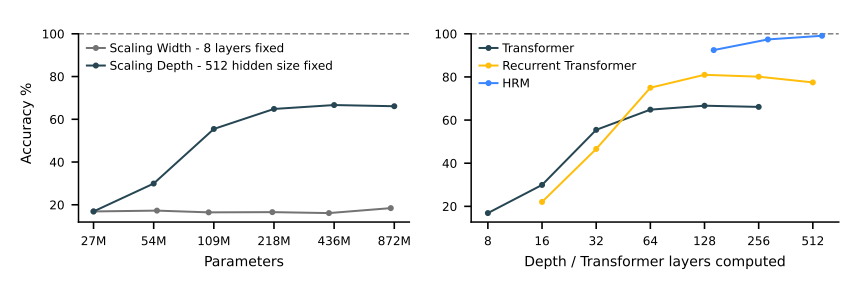
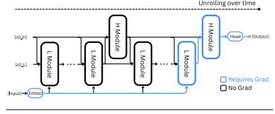

## HRM Overview


### Motivation and Scaling Behavior



> **Key Insight**: $\text{Performance} \propto \text{Depth}$ with diminishing returns from width scaling. We prefer adaptive iterative refinement over parameter expansion. By applying the Implicit Function Theorem assuming a fixed point from convergent features, we can use a one-step gradient approximation for optimization. 

A later variant from *Less is More: Recursive Reasoning with Tiny Networks* computes a full-step gradient, resulting in significant improvement. 

**Remark**: 
- **Negative View:** More depth does not necessarily improve results even with *Hierarchical convergence*, as suggested by a recent reproduction of results—even compared to a typical recurrent transformer. We can practically consider the full-step gradient based on the task.
- **Positive View:** There are multiple ways for solving a sudoku, or multiple trajectories of reasoning for the same conclusion. A full-step gradient can be excessive, whereas we could consider RL objectives with one-step gradient approximation.

### Core Concept

This study proposes a model where the L-module governs game play, with its behavior shaped and validated by additive constraints from the rules at each step. The H-module provides high-level guidance by introducing its own set of additive constraints.

- **L-Module (Low-level/Fast)**: The operator that mimics human low-level reasoning by processing local information within a single temporal cycle (e.g., a single turn in a game). It is constrained by explicit rules and local context.
- **H-Module (High-level/Slow)**: The strategic, long-term memory component. It operates across multiple temporal cycles, integrating past experiences to provide high-level guidance or context to the L-module.

#### L-Module (Low-level/Fast Module)
At each timestep $i$, the L-module updates its state conditioned on:
- Its own previous state $z_L^{i-1}$
- The H-module's current state $z_H^{i-1}$ (which remains fixed throughout the cycle)
- The input representation $\hat{x}$

$$z_L^i = f_L(z_L^{i-1}, z_H^{i-1}, \hat{x}; \theta_L)$$

#### H-Module (High-level/Slow Module)
The H-module updates **only once per cycle** (every $T$ timesteps), using the L-module's final state at the end of that cycle:

$$z_H^i = \begin{cases} 
f_H(z_H^{i-1}, z_L^{i-1}; \theta_H) & \text{if } i \equiv 0 \pmod{T} \\
z_H^{i-1} & \text{otherwise}
\end{cases}$$

After $N$ full cycles (i.e., $NT$ timesteps), a prediction $\hat{y}$ is extracted from the hidden state of the H-module:

$$\hat{y} = f_O(z_H^{NT}; \theta_O)$$

<p align="center">
  
</p>

### Implementation Details

**Input Embeddings Structure**:
```python
input_embeddings = [puzzle_emb | token_emb] + position_emb
# where:
#   - puzzle_emb: Zero-initialized task identifier
#   - token_emb: Actual problem tokens (input sequence)
```

**L-Level (Low-Level Module) Injection**:
```python
z_L = L_level(z_L, z_H + input_embeddings)

# Inside L_level.forward():
def forward(self, hidden_states, input_injection):
    hidden_states = hidden_states + input_injection  # z_L + (z_H + input_embeddings)
    # Process through layers...
```

**L-Module Update:**
```python
z_L = L_level(z_L, z_H + input_embeddings)
hidden_states = hidden_states + input_injection  # z_L + (z_H + input_embeddings)
```

**H-Module Update:**
```python
z_H = H_level(z_H, z_L) 
hidden_states = hidden_states + input_injection  # z_H + z_L
```

### Key Characteristics
1. **Temporal Hierarchy**: L-module operates at fine-grained timesteps; H-module operates at coarse-grained cycles
2. **Information Flow**: L→H (every T steps), H→L (every step, additive conditioning)
3. **Feature Refinement by Constraints**: A fixed stepwise input embedding and H-module's constraint allow progressive reasoning using the L-module

>The converged features are overfitted to a specific task and are essentially collapsed from general application—proposing a major challenge of transferring conditioning for alternative reasoning tasks. For long-term memory study, we hope to deal with this issue by using multiple memory cells and having agents communicate using a cross-attention bottleneck. 

### Key Insights

1. The H-level's design is oversimplified with the exact same architecture as the L-level according to their code implementation.

2. There are multiple ways for solving a sudoku, or multiple trajectories of reasoning for the same conclusion. A full-step gradient can be excessive, and we hope to frame this as RL objectives with one-step gradient approximation.

3. A Transformer Encoder is more suitable for implicit reasoning. A decoder architecture's causal mask prevents the refinement of existing token features, creating a bottleneck for updating the internal causal relationships between them. This limitation is evident in decoder-only Chain-of-Thought (CoT) methods, which have been shown to be less efficient on specific tasks and often require very large models to perform reasoning within a single causal paradigm. (A potential extension is to construct a hypergraph over the input tokens, where each hyperedge defines an implicit reasoning sub-task. These sub-tasks could be processed in parallel by recursive reasoning modules, with the resulting enriched representations serving as conditioning for a final autoregressive decoder.)

## Proposal for long-term memory mechanism

The human brain is essentially a sparse multimodal composition for aggregating information into more refined abstract entities, thereby exhibiting reasoning behaviors. The entity features have been processed at a significantly deep level without collapsing their information. We propose using bidirectional cross-attention as a memory bottleneck to construct and refine memory. We have the following interpretations:

1. **Discrete modeling:** We can interpret "long-term" memory as a collection of distinct dynamic entities—each memory cell's features can be iteratively refined using the H-module, with [CLS] tokens representing each cell's current state and identity.
2. **Self-multimodality:** A modal entity can be built by composing different concepts, or as a mixture of modalities. We propose a sparse activation mechanism over multiple specialized memory cells.

In the following section, we discuss the memory update rules without specifying the refined roles of the H and L-modules. The L-module, for example, could be a decoder-only transformer.

### 1. Basic architectures


**Components**:
- $\mathcal{M} = \{m_1, m_2, \ldots, m_N\}$: Set of $N$ long-term memory cells
- $\text{CLS}_i^t$: Class token for cell $m_i$, updated jointly with the cell
- $k$: Number of cells to activate
- $z_H$: Persistent short-term memory

**Cell Representation**: Each memory cell $i$ consists of:

$$m_i^t = [\text{CLS}_i^t; \text{content}_i^t]$$

where $\text{CLS}_i^t$ serves dual purposes: (1) current state summary for selection scoring, and (2) evolving identity marker that refines with the cell's content. While self-attention after cross-attention could refine the CLS-content relationship within each cell, we present the minimal architecture below.

**State Normalization**:
Let the combined state $h^t$ be formed via token-wise additive conditioning, defined as the sum of the H and L module states: $h^t = z_H^t + z_L^{T-1}$. The normalized version of this state is denoted $\hat{h}^t = \text{LN}(h^t)$. Each memory cell is also independently normalized as $\hat{m}_i^t = \text{LN}(m_i^t)$.

**Top-k Cell Selection**:

$$\mathcal{A}^t = \text{TopK}\left(\{s_i^t\}_{i=1}^N, k\right)$$

where the selection score can be computed via:

$$s_i^t = \frac{1}{R} \sum_{r=1}^{R} \text{CLS}(\hat{m}_i^t)^\top W_r \text{CLS}(\hat{h}^t)$$

where $R$ is a hyperparameter for the number of relevance projections used to capture different matching patterns.

**Cell Specialization via Load Balancing**

To encourage specialization and prevent computational imbalance where only a few cells are consistently selected, we adopt the load balancing auxiliary loss from Mixture-of-Experts (MoE) literature. This ensures that all memory cells participate in learning and contribute to the overall representation. The objective is defined as:

$$\mathcal{L}_{\text{balance}} = \lambda \cdot \sum_{i=1}^N f_i \cdot P_i$$

where $f_i$ is the fraction of states routed to cell $i$ within a batch, and $P_i$ is the average gate probability for cell $i$ over the same batch. 

**Parallelized H-Module Processing**

The bidirectional cross-attention implements the same **temporal-shift update pattern**:
- **Retrieve**: $m_i^t \rightarrow z_H^{t+1}$ (retrieve from current memory cells)
- **Update**: $z_H^{t+1} \rightarrow m_i^{t+1}$ (write new knowledge to next memory state)

1. **Memory-to-State** (retrieve from current memory cells to update state):
Let the normalized combined state be $\hat{h}^t = \text{LN}(h^t)$. The retrieved information $\Delta z$ is the weighted sum of cross-attentions between this state and the selected memory cells:

$$\Delta z = \sum_{i \in \mathcal{A}^t} \alpha_i \cdot \text{Attention}(\hat{h}^t, \hat{m}_i^t, \hat{m}_i^t)$$

where $\boldsymbol{\alpha} = \text{Softmax}(\{s_i^t\}_{i \in \mathcal{A}^t})$.

> This could serve as a self-supervision target for the highest-scoring cell $m_j$ (where $j = \arg\max_{i \in \mathcal{A}^t} s_i^t$), i.e., $\mathcal{L}_{\text{self-sup}} = \|\Delta z - \text{Attention}(\hat{h}^t, \hat{m}_j^t, \hat{m}_j^t)\|^2$

2. **State Update** (incorporate retrieved information):


$$z_H^{t+1} = h^t + \Delta z + \text{FFN}(\text{LN}(h^t + \Delta z))$$

3. **State-to-Memory** (updated state gates what to write to next memory state):

Let the normalized updated state be $\hat{z}_H^{t+1} = \text{LN}(z_H^{t+1})$. Each selected memory cell performs a full cross-attention to this updated state to determine its own update, $\Delta m_i$:

$$\Delta m_i = \text{Attention}(\hat{m}_i^t, \hat{z}_H^{t+1}, \hat{z}_H^{t+1})$$

$$m_i^{t+1} = m_i^t + \Delta m_i + \text{FFN}(\text{LN}(m_i^t + \Delta m_i)), \quad \forall i \in \mathcal{A}^t$$

**Final Update Rules**:

$$z_H^i, \mathcal{M}^i = \begin{cases} 
\text{MultiModalAttn}(\mathcal{M}^{i-1}, z_H^{i-1}, z_L^{i-1}, k; \theta_H) & \text{if } i \equiv 0 \pmod{T} \\
z_H^{i-1}, \mathcal{M}^{i-1} & \text{otherwise}
\end{cases}$$

**Main Challenges**:

1. **Computational cost:** With $k$ selected cells, requires $2k$ cross-attention operations per H-module update where we require $k$ parallel operations for both Memory-to-State retrieval and State-to-Memory writing
2. **Memory scaling:** With $k$ active memory cells, attention computation and memory requirements scale by factor of $k$, increasing overhead during inference
3. **Gradient Stability in Hypergraph Models:** In the proposed hypergraph extension, a single token can participate in multiple hyperedges (sub-tasks) simultaneously. This could result in chaotic or conflicting gradient updates, as each sub-task may pull the token's representation in a different direction, posing a significant optimization challenge.

**Potential Advantages**:
1. **Persistent contextual reasoning**: Memory cells maintain context across H-module cycles, enabling consistent long-term reasoning
2. **Cross-model memory sharing**: Well-designed CLS-memory dynamics could enable memory modules to broadcast reasoning conditioning across different models
3. **Online contextual adaptation**: Memory state evolution during inference enables real-time adaptation to new contexts without weight modification

### 2. Reinforcement Learning Objectives

$\pi_\theta(\mathcal{A}|\hat{h}, \{\text{CLS}_i^t\}_{i=1}^N)$
